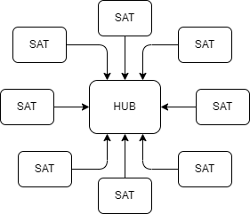

### Коротко суть проблемы

Часто данные об объектах реального мира хранятся в виде комплекта hub-satellites. В реляционной модели данных для каждого сателлита создаётся отдельная таблица.

Например:

- юр.лицо и его: директора, главбухи, учредители, юр.адреса, виды деятельности и т.д.

или

- объект недвижимости и его: помещения, этажи, планы, и т.д.

В такой модели при попытке собрать объект целиком нужно прочитать данные из множества таблиц-сателитов. Это приводит к тому, что даже для небольших объектов нужно выполнить множество операций ввода-вывода, что снижает быстродействие и повышает требования к инфраструктуре. В частности, при запросе наиболее популярной выписки из витрины ЕГРН генерируется 26 sql запросов, большинство из которых - это чтение сателлитов.

Можно рассмотреть 4 типа хранения для решения данной проблемы:

1. **Хранение данных в памяти.** Просто реализовать, но цена решения будет высока. Рост объёма данных будет линейно тянуть за собой стоимость решения. имеет смысл применять, если финансы - не проблема и не ожидается существенного роста объёма данных.
1. **Хранение предпостроенных выписок.** Если хранить выписки по объекту компактно, то за счёт сжатия много лишнего места они не займут. Но нужно перестраивать выписки как при изменениях данных, так и при изменениях форматов самих выписок.
1. **Хранение hub-ов в виде документов в одной записи вместе со всеми сателлитами.** Это решает вопрос с перестройкой предпостроенных выписок при измененнии формата выписки, но при каждом изменении каждого сатлита нужно перестраивать документ. Кроме того, есть риск, что некоторые документы будут гигантскии и для них придётся изобретать альтернативный способ.
1. **Хранение всех сателлитов в разных записях, но в одной общей таблице.** Т.е. хранить прикладные данные в виде сериализованного BLOB. Этот способ позволяет сохраняить реляционную модель с точки зрения запросов, эффективно обновлять данные построчно. Можно строить запросы к отдельным сателлитам, эффективно искать сателлиты по индексам. Но сканирование всех экземпляров сателлита (например, просмотр таблицы помещений) становится неэффективным, т.к. теперь их данные лежат не компактно, а размазаны по общей таблицы.

Ниже рассмотрим как можно реализовать пункт **4.**

### Постановка задачи

_Компактно хранить сателлиты одной конкретной строки хаба, чтобы их всех можно было прочитать за одну (в идеале) операцию ввода-вывода. При этом нужно сохранить преимущества реляционной модели: обращения к сателлитам как к отдельным талицам, в т.ч. независимая построчная вставка/обновление/удаление данных сателлитов._

### Компактное хранение свойств объектов

Предлагается хранить данные по каждому сателлиту в сериализованном виде в единственном бинарном поле. А для возможности работы с атрибутами определить форматы для каждого типа сателлитов. И в соответствие с этими форматами производить сериализацию/десериализацию атрибутов сателлитов.

Тогда, отсортировав такую таблицу по первичному ключу хаба, мы с высокой вероятностью разместим всех сателлитов в непрерывной области файла данных БД. По крайней мере БД будет стремится это обеспечить.

### Рассмотрим пример

Создаём таблицу-хранилище для объектов недвижимости
~~~ sql
CREATE TABLE real_estate(
    hub_key     text,       -- первичный ключ объекта недвижимости
    rec_type    text,       -- тип сателлита (фактически, мнемоника формата)
    sat_key     text,       -- первичный ключ сателлита
    binary_data varbinary,  -- сериализованные данные
    PRIMARY KEY(hub_key, rec_type, sat_key),
    UNIQUE(rec_type, sat_key)
)
~~~

Далее создаём форматы binary_data для разного типа записей

~~~ sql
-- основные данные по объекту недвижимости
CREATE FORMAT main
FOR real_estate(rec_type, binary_data)
(
    cad_number      text, -- кадастровый номер объекта недвижимости
    object_address  text  -- адрес объекта недвижимости
)

-- помещения объекта
CREATE FORMAT rooms
FOR real_estate(rec_type, binary_data)
(
    room_number text,  -- номер помещения
    room_area real     -- площадь помещения
)

-- этажи объекта недвижимости
CREATE FORMAT floors
FOR real_estate(rec_type, binary_data)
(
    floor_number text, -- номер этажа объекта недвижимости
    floor_kind int     -- вид этажа
)

-- и так далее, для каждого формата сателлита
~~~

Конструкция **FOR table_name(selector_attribute, storage_attribute)** определяет таблицу и поля, для которых определяется формат.

Вставка производится с использованием формата:

~~~ sql
INSERT INTO real_estate.main(hub_key, sat_key, cad_number, object_address)
VALUES(
    '123456',              -- hub_key
    '123456',              -- sat_key (равен hub_key для основной сущности)
    '69:00:0000000:000',   -- cad_number
    'ул. Ленина, д. 7'     -- object_address
)
~~~

Такой запрос переписывается внутри БД к виду

~~~ sql
INSERT INTO real_estate(hub_key, rec_type, sat_key, binary_data)
VALUES(
    '123456',              -- hub_key
    'main',                -- rec_type
    '123456',              -- sat_key
    0x621872...735724      -- binary_data
)
~~~

При этом БД автоматически сериализует атрибуты формата в бинарный блок данных

Если нужно прочитать данные по формату, формируется запрос вида

~~~ sql
SELECT * FROM real_estate.main WHERE hub_key = '123456'
~~~

При этом БД переписывает запрос к виду

~~~ sql
SELECT * FROM real_estate WHERE hub_key = '123456' AND rec_type = 'main'
~~~

Затем десериализует *binary_data* согласно формату и возвращает в ответе рекордсет вида:

|hub_key|sat_key|cad_number|object_address|
|-|-|-|-|
|123456|123456|69:00:0000000:000|ул. Ленина, д. 7|

Если нужно прочитать все данные для заданного hub_key (или иного условия) -- выполняется запрос в таблице-хранилищу

~~~ sql
SELECT * FROM real_estate WHERE hub_key = '123456'
~~~

В этом случае БД возвращает данные как есть

|hub_key|rec_type|sat_key|binary_data|
|-|-|-|-|
|123456|main|123456|0x621872...735724|

Клиенту нужно иметь библиотеку для самостоятельной десериализации из binary_data

### Создание индексов

Для эффективного поиска должна быть возможность создания индексов на форматы. Например:

~~~ sql
CREATE INDEX ix_real_estate_main_cad_number
ON real_estate.main(cad_number)
~~~

Такое выражение переписывается сервером к виду

~~~ sql
CREATE INDEX ix_real_estate_main_cad_number
ON real_estate(extract(binary_data, 'main', 'cad_number'))
WHERE rec_type = 'main'
~~~

При выборке данных можно использовать выражение вида

~~~ sql
SELECT * FROM real_estate.main
WHERE cad_number = '69:00:0000000:000'
~~~

которое должно быть переписано к виду:

~~~ sql
SELECT * FROM real_estate
WHERE extract(binary_data, 'main', 'cad_number') = '69:00:0000000:000'
~~~

Это должно привести к использованию функционального индекса, определённого ранее.

### Пример получения выписки по кадастровому номеру.

1. Получем hub_key по кадастровому номеру
~~~ sql
SELECT hub_key FROM real_estate.main
WHERE cad_number = '69:00:0000000:000'
~~~

2. Получаем данные всех сателлитов
~~~ sql
SELECT * FROM real_estate
WHERE hub_key = '123456'
AND rec_type in ('main', 'floor', ...) -- опционально, фильтруем только необходимые сателлиты 
~~~

3. На клиенте десериализуем данные и форматируем выписку. Десериализацию можно "спрятать" в обработчике pebble-шаблонов и полностью скрыть от прикладного разработчика.
